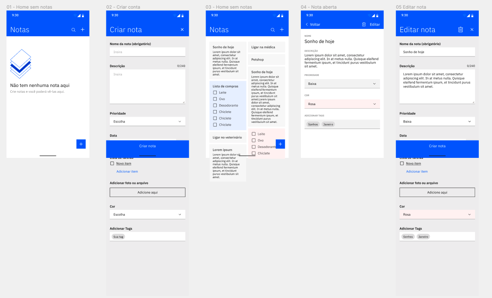

# Projeto Aplicativo Notas

### 
 [Sobre](#sobre) | [Layout](#layout) | [Preview](#preview) | [Dependências Utilizadas](#dependências-utilizadas) | [Funcionalidades](#funcionalidades) 

  

## Sobre 

Esse projeto/desafio foi desenvolvido como parte final do treinamento de React Native.

---

## Layout

Layout do projeto a ser feito (figma)

## Preview

<table align="center">
   <tr>
    <td valign="top"> </td>
    
   </tr>
 </table>
  

---

##  **Dependências utilizadas**

   - <a href="https://github.com/react-navigation"> React Navigation </a>
   - <a href="https://github.com/react-native-async-storage/async-storage"> React Native Async Storage</a>
   - <a href="https://github.com/WrathChaos/react-native-bouncy-checkbox"> React-Native-Bouncy-Checkbox </a>
   - <a href="https://github.com/peterp/react-native-tags#readme"> React-Native-Tags </a>
   - <a href="https://github.com/hossein-zare/react-native-dropdown-picker"> React Native Dropdown Picker 5.3 </a>
   - <a href="https://github.com/CaioQuirinoMedeiros/react-native-mask-input"> React Native Mask Input</a>
---

## **Funcionalidades**

   - [x] *Navegação dinâmica utilizando Stack Navigation*
   - [x] *Async Storage como banco de dados local*
   - [x] *Checklist, Tags, seleção dropdown*
   - [x] *Criar Nota*
   - [x] *Excluir Nota*
   - [ ] *Selecionar arquivo ou imagem* 
   - [ ] *Editar Nota*
   - [ ] *Pesquisar Nota*

## 👩🏻‍💻 **Autora**

<a href="https://github.com/vaniamesquita"> 
  
 Feito com :blue_heart: por <b>Vania Mesquita</b></a>  

 

